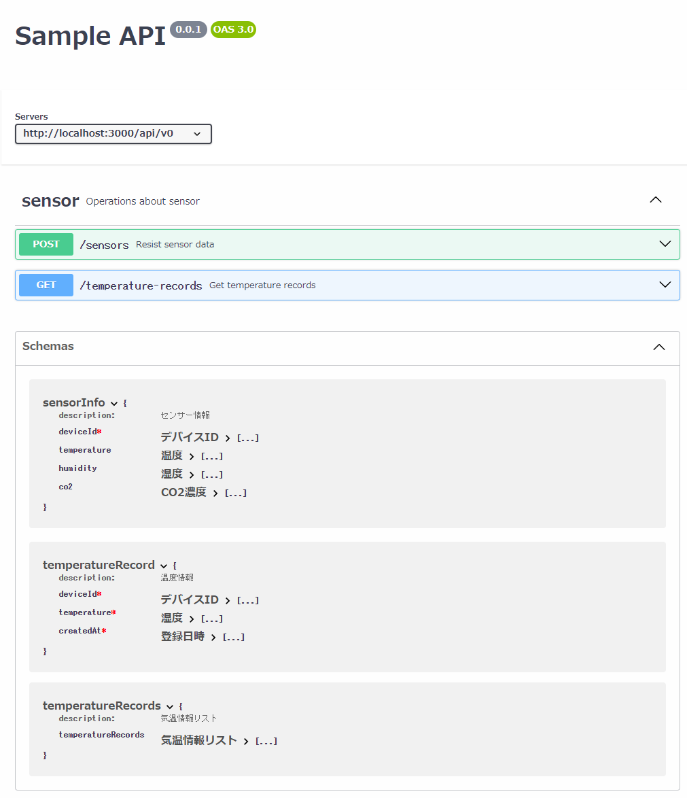

<!-- omit in toc -->
# OpenAPI＋FastAPI＋TypeScriptで自動コード生成

異なるソフトウェアが情報をやりとりする手段には様々なプロトコルが存在します。\
私が最近勉強しているのはWebAPIです。\
ここではWebAPIをOpenAPIで設計し、PythonやTypescriptのコードを自動生成したときのメモを共有します。

<!-- omit in toc -->
## 目次

- [1. 実現したいこと](#1-実現したいこと)
- [2. APIとは？](#2-apiとは)
  - [2.1. WebAPIとは](#21-webapiとは)
  - [2.2. OpenAPIとは](#22-openapiとは)
- [3. API設計](#3-api設計)
  - [3.1. openapi.yaml](#31-openapiyaml)
  - [3.2. 自動生成されるドキュメント](#32-自動生成されるドキュメント)
- [4. コード自動生成](#4-コード自動生成)
  - [4.1. Python FastAPIの型定義ファイル自動生成](#41-python-fastapiの型定義ファイル自動生成)
    - [4.1.1. fastapi-code-generator](#411-fastapi-code-generator)
      - [4.1.1.1. main.py（このファイルは直接は使わないが、骨組みとして参考にする）](#4111-mainpyこのファイルは直接は使わないが骨組みとして参考にする)
      - [4.1.1.2. models.py（型定義ファイルとして活用する）](#4112-modelspy型定義ファイルとして活用する)
  - [4.2. TypeScriptのAPIクライアントコード自動生成](#42-typescriptのapiクライアントコード自動生成)
    - [4.2.1. openapi-generator-cliのインストール](#421-openapi-generator-cliのインストール)
    - [4.2.2. package.jsonへの設定](#422-packagejsonへの設定)
    - [4.2.3. クライアントコードの自動生成](#423-クライアントコードの自動生成)
    - [4.2.4. 自動生成されたファイルの抜粋](#424-自動生成されたファイルの抜粋)
    - [4.2.5. 実際に使用する](#425-実際に使用する)
    - [4.2.6. 参考にさせていただいたURL](#426-参考にさせていただいたurl)
- [5. おすすめUdemy講座](#5-おすすめudemy講座)

## 1. 実現したいこと

部屋に温湿度CO2センサを設置して1時間おきにセンサ情報を記録し、それをスマホで確認できるアプリケーションを作りたいとします。\
このときマイコンとPC、PCとスマホの情報のやり取りをWebAPIで実現することとします。

そして以下2点を大切にします。

- APIの仕様を見やすいドキュメントで共有したい
- API仕様が変わったときの、ドキュメントやコードの修正工数をできるだけ小さくしたい

## 2. APIとは？

APIとは「Application Programming Interface」の略で、アプリケーションの一部の機能やデータをアプリケーション間や外部システムから利用したり連携させるインターフェース仕様のことです。\
今回は中央のPCがAPIサーバーとなり、マイコンやスマホブラウザがこのAPIを利用する構成にします。

### 2.1. WebAPIとは

Web APIはAPIの一種で、日常的に利用しているWebブラウザーで用いられているHTTP/HTTPSプロトコル（通信規則）を用いてネットワーク越しにアプリケーション間で利用できるインターフェースです。\
HTTP/HTTPSプロトコルはWebブラウザーとWebサーバーの間でデータをやり取りする通信規格であるため、広く一般的に用いられています。

### 2.2. OpenAPIとは

OpenAPIとは「Open API Spesification」の略で、APIの仕様を記述するための標準規格です。以下の特徴があります。

- **言語中立性**：APIの仕様をJSONやYAMLファイルで記述でき、APIのエンドポイント、パラメータ、レスポンスなどの定義ができます
- **ドキュメント自動生成**：APIに関する詳細な情報が記載されたインタラクティブなドキュメントを自動生成できます
- **コード自動生成**：さまざまなプログラミング言語でAPIクライアントのコードを自動生成できます

とりあえずOpenAPIで設計しておけば、バックエンドもフロントエンドも実装が楽になること間違いなしです。

## 3. API設計

まず、OpenAPIでAPIを設計します。JSONまたはYAMLで定義できますが、行数が少なく済むYAMLの方がよく使用されます。\
ここではマイコンから`http://XXX.XXX.XXX.XXX:3000/api/v0/sensors`にセンサー情報（温度、湿度、CO2濃度）をまとめてPOSTし、\
スマホから`http://XXX.XXX.XXX.XXX:3000/api/v0/temperature-records`で温度情報のリストをGETするAPIを定義しています。\
（行数が長くなるため湿度やCO2濃度の取得APIは割愛します）

### 3.1. openapi.yaml

~~~yaml
openapi: 3.0.2
info:
  title: Sample API
  version: 0.0.1
servers:
  - url: http://localhost:3000/api/v0
tags:
  - name: sensor
    description: Operations about sensor
paths:
  /sensors:
    post:
      tags:
        - sensor
      operationId: registSensorInfo
      summary: Resist sensor data
      description: 複数のセンサー情報を登録します
      requestBody:
        content:
          application/json:
            schema:
              $ref: '#/components/schemas/sensorInfo'
      responses:
        '200':
          description: OK
  /temperature-records:
    get:
      tags:
        - sensor
      operationId: getTemperatureRecords
      summary: Get temperature records
      description: 温度を取得します
      parameters:
        - $ref: '#/components/parameters/queryDevice'
        - $ref: '#/components/parameters/queryStart'
        - $ref: '#/components/parameters/queryEnd'
      responses:
        '200':
          description: OK
          content:
            application/json:
              schema:
                $ref: '#/components/schemas/temperatureRecords'
components:
  schemas:
    sensorInfo:
      description: センサー情報
      type: object
      properties:
        deviceId:
          title: デバイスID
          type: string
        temperature:
          title: 温度
          type: number
        humidity:
          title: 湿度
          type: number
        co2:
          title: CO2濃度
          type: number
      required:
        - deviceId
    temperatureRecord:
      type: object
      description: 温度情報
      properties:
        deviceId:
          title: デバイスID
          type: string
        temperature:
          title: 温度
          type: number
        createdAt:
          title: 登録日時
          type: string
          example: '2023-12-06T23:59:59+09:00'
          format: date-time
      required:
        - deviceId
        - temperature
        - createdAt
    temperatureRecords:
      description: 気温情報リスト
      type: object
      properties:
        temperatureRecords:
          title: 気温情報リスト
          type: array
          items:
            $ref: '#/components/schemas/temperatureRecord'
  parameters:
    queryDevice:
      name: deviceId
      in: query
      description: デバイスID
      required: false
      schema:
        type: string
    queryStart:
      name: start
      in: query
      description: 開始日時
      required: false
      schema:
        type: string
        example: '2023-12-06T23:59:59+09:00'
        format: date-time
    queryEnd:
      name: end
      in: query
      description: 終了日時
      required: false
      schema:
        type: string
        example: '2023-12-06T23:59:59+09:00'
        format: date-time
~~~

### 3.2. 自動生成されるドキュメント

VSCodeを使用している場合、以下の拡張機能を追加してopenapi.yamlを開きプレビューすると、APIに関する詳細なドキュメントを閲覧することができます。

- OpenAPI (Swagger) Editor

見やすいドキュメントを自動生成してくれるのも、OpenAPIのいいところだと思います。

## 4. コード自動生成

APIの仕様を決めたら、型定義ファイルやAPIクライアントのコードをプログラミング言語に合わせて自動生成します。\
そうすることでもしAPIの仕様に変更が生じた場合も、OpenAPIのYAMLファイルさえ修正すればコマンド一つで他の言語のコードにも変更が反映されて、とても幸せになれます。\
今回は、バックエンドにPython（FastAPI）を、フロントエンドにTypeScript（Next.js+React）を採用することとし、FastAPI用の型定義ファイルと、TypeScript用のAPIクライアントコードを自動生成します。

### 4.1. Python FastAPIの型定義ファイル自動生成

FastAPIはPythonのWebフレームワークです。\
コードファーストでOpenAPIのスキーマファイルを自動生成できる点でも人気の高いフレームワークですが、\
今回はスキーマファーストでOpenAPIスキーマファイルからFastAPIに必要なコードを生成します。

#### 4.1.1. fastapi-code-generator

コードの自動生成にはfastapi-code-generatorを使用します。\
<https://github.com/koxudaxi/fastapi-code-generator>\
ターミナルを開いて以下を実行します。\
--inputでyamlファイルを指定し、--outputで出力ファイルを指定します。

~~~bash
pip install fastapi-code-generator
fastapi-codegen --input ./openapi/openapi.yaml --output ./src/webserver/api
~~~

これでsrc/webserver/apiディレクトリにmain.pyとmodels.pyが自動生成されます。\
models.pyは活用しますが、main.pyは使いません。（main.pyを変更すると、次に自動生成したとき上書き削除されてしまうため）\
私はmain.pyをgit管理から除外するようにしています。

~~~gitignore

# .gitignore
src/webserver/api/main.py
~~~

main.pyを直接書き換えることはしませんが、自身のメインファイルに内容をコピーして中身を書いていくのに活用します。

##### 4.1.1.1. main.py（このファイルは直接は使わないが、骨組みとして参考にする）

~~~python
# generated by fastapi-codegen:
#   filename:  openapi.yaml
#   timestamp: 2023-12-12T12:50:12+00:00

from __future__ import annotations

from datetime import datetime
from typing import Optional

from fastapi import FastAPI, Query

from .models import SensorInfo, TemperatureRecords

app = FastAPI(
    title='Sample API',
    version='0.0.1',
    servers=[{'url': 'http://localhost:3000/api/v0'}],
)

@app.post('/sensors', response_model=None, tags=['sensor'])
def regist_sensor_info(body: SensorInfo = None) -> None:
    """
    Resist sensor data
    """
    pass

@app.get('/temperature-records', response_model=TemperatureRecords, tags=['sensor'])
def get_temperature_records(
    device_id: Optional[str] = Query(None, alias='deviceId'),
    start: Optional[datetime] = None,
    end: Optional[datetime] = None,
) -> TemperatureRecords:
    """
    Get temperature records
    """
    pass
~~~

##### 4.1.1.2. models.py（型定義ファイルとして活用する）

~~~python
# generated by fastapi-codegen:
#   filename:  openapi.yaml
#   timestamp: 2023-12-12T12:50:12+00:00

from __future__ import annotations

from datetime import datetime
from typing import List, Optional

from pydantic import BaseModel, Field

class SensorInfo(BaseModel):
    deviceId: str = Field(..., title='デバイスID')
    temperature: Optional[float] = Field(None, title='温度')
    humidity: Optional[float] = Field(None, title='湿度')
    co2: Optional[float] = Field(None, title='CO2濃度')

class TemperatureRecord(BaseModel):
    deviceId: str = Field(..., title='デバイスID')
    temperature: float = Field(..., title='湿度')
    createdAt: datetime = Field(..., example='2023-12-06T23:59:59+09:00', title='登録日時')

class TemperatureRecords(BaseModel):
    temperatureRecords: Optional[List[TemperatureRecord]] = Field(None, title='気温情報リスト')

~~~

### 4.2. TypeScriptのAPIクライアントコード自動生成

ブラウザで動作するJavaScriptは動的型付け言語であり、実行するまでエラーの存在に気付きにくく、バグが起こりやすいという問題点がありました。\
TypeScriptは、JavaScriptを拡張して作られたプログラミング言語で、あらかじめ変数の型を定義する静的型付けを採用しています。\
このため規模の大きなWeb開発で利用されるケースが増えている言語です。\
今回フロントエンドに採用するNext.js+ReactのフレームワークでもTypeScriptを使用します。

#### 4.2.1. openapi-generator-cliのインストール

コードの自動生成にはopenapi-generator-cliを使用します。\
以下のコマンドでインストールできます。\
`-D`オプションは開発環境にインストールを限定します。

~~~bash
npm install @openapitools/openapi-generator-cli -D
~~~

#### 4.2.2. package.jsonへの設定

以下のように`pachage.json`へコマンドを登録することで、次回から「npm run generate:api」で実行できるようになります。\
ここではaxiosを使用したクライアントコードを生成する設定にしています。

~~~json
/* package.json */
"scripts": {
  "generate:api": "openapi-generator-cli generate -g typescript-axios -i ../openapi/openapi.yaml -o ./src/hooks/api/typescript-axios",
}
~~~

#### 4.2.3. クライアントコードの自動生成

ターミナルを開いて以下を実行します。

~~~bash
npm run generate:api
~~~

#### 4.2.4. 自動生成されたファイルの抜粋

以下は自動生成されたファイルの`api.ts`の一部です。\
`getTemperatureRecords`と`registSensorInfo`のクライアントコードが自動生成されています。

~~~typescript
/**
 * SensorApi - object-oriented interface
 * @export
 * @class SensorApi
 * @extends {BaseAPI}
 */
export class SensorApi extends BaseAPI {
    /**
     * 温度を取得します
     * @summary Get temperature records
     * @param {string} [deviceId] デバイスID
     * @param {string} [start] 開始日時
     * @param {string} [end] 終了日時
     * @param {*} [options] Override http request option.
     * @throws {RequiredError}
     * @memberof SensorApi
     */
    public getTemperatureRecords(deviceId?: string, start?: string, end?: string, options?: AxiosRequestConfig) {
        return SensorApiFp(this.configuration).getTemperatureRecords(deviceId, start, end, options).then((request) => request(this.axios, this.basePath));
    }

    /**
     * 複数のセンサー情報を登録します
     * @summary Resist sensor data
     * @param {SensorInfo} [sensorInfo] 
     * @param {*} [options] Override http request option.
     * @throws {RequiredError}
     * @memberof SensorApi
     */
    public registSensorInfo(sensorInfo?: SensorInfo, options?: AxiosRequestConfig) {
        return SensorApiFp(this.configuration).registSensorInfo(sensorInfo, options).then((request) => request(this.axios, this.basePath));
    }
}
~~~

#### 4.2.5. 実際に使用する

自動生成されたクライアントコードをフロントエンドで使用するために、configやaxiosを渡した状態のインスタンスを定義してexportしておきます。\
具体的にはベースPathを設定します。

~~~typescript
/* apiClients.ts */
import { SensorApi } from "@/hooks/api/generated-api/api";

import { Configuration } from "@/hooks/api/generated-api/configuration";

import axios from "axios";

let origin = "http://localhost:3000";
if (location != undefined) {
  origin = location.origin;
}
const basePath = origin + "/api/v0";

const config = new Configuration({
  basePath: basePath,
});

const axiosInstance = axios.create({
  baseURL: basePath,
  withCredentials: true,
});

const sensorApi = new SensorApi(config, "", axiosInstance);

export { sensorApi };
~~~

あとは上記を呼び出すだけでOKです。

~~~typescript
/* page.tsx */
"use client";
import { Button } from '@chakra-ui/react'
import { sensorApi } from "@/hooks/apiClients";

export default function Home() {
  const onClickButton = () => {
    sensorApi
      .getTemperatureRecords()
      .then((response) => {
        console.log(response);
      })
      .catch((error) => {
        console.log(error);
      });
  };
  return (
    <>
      <Button onClick={onClickButton}>温度情報取得</Button>
    </>
  );
}
~~~

#### 4.2.6. 参考にさせていただいたURL

OpenAPI Generator TypeScript Axiosで型付きリクエストの自動生成 | Offers Tech Blog
<https://zenn.dev/overflow_offers/articles/20220620-openapi-generator>

## 5. おすすめUdemy講座

以下は私が受講したUdemyの講座です。特に1つめは網羅的でとても勉強になったので紹介いたします。

- REST WebAPI サービス 設計
- Learn Swagger and the OpenAPI Specification
