<!-- omit in toc -->
# RoomEye概要設計書

RoomEyeの概要設計内容を記載する

<!-- omit in toc -->
## 目次

- [1. ユースケース図](#1-ユースケース図)
- [2. ハードウェア構成図](#2-ハードウェア構成図)
- [3. コンテキスト図](#3-コンテキスト図)
- [4. データフロー図](#4-データフロー図)
  - [4.1. DFD0](#41-dfd0)
- [5. データ辞書](#5-データ辞書)
- [6. モジュール構造図](#6-モジュール構造図)

## 1. ユースケース図

以下のユースケースを実現する

## 2. ハードウェア構成図

以下の構成とする

## 3. コンテキスト図

システムのフォーカスを以下に示す

## 4. データフロー図

データの流れを以下に示す

### 4.1. DFD0

## 5. データ辞書

- 通過検知情報 = *人が通過した情報*
- カメラ映像 = *カメラからの画像情報*
- 点灯指示 = *NatureRemoに登録された照明を点灯させる指示*
- 消灯指示 = *NatureRemoに登録された照明を消灯させる指示*
- 人検知情報 = *人を検知した情報*
- 寝ころび検知情報 = *寝ころびを検知した情報*

## 6. モジュール構造図

以下にモジュール構造図を示す

